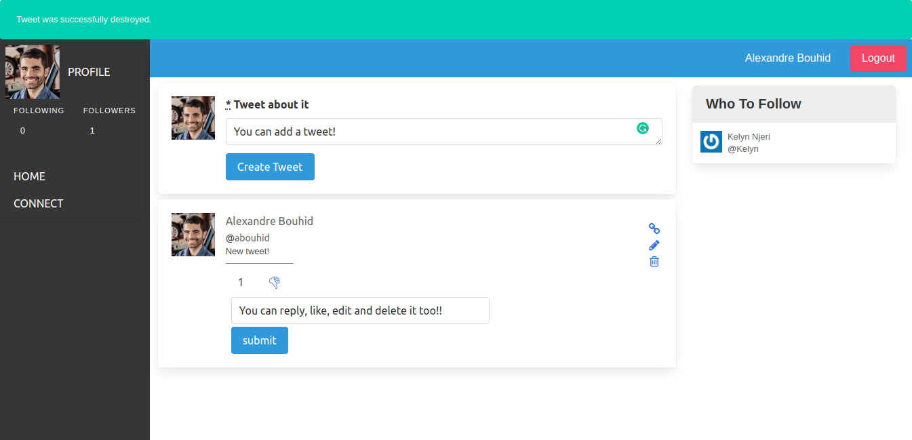

# Ruby on Rails Capstone Project



> This project consists of applying all the knowledge of Ruby on Rails I have aquired through the module in order to develop a real social media app. The challenge here was starting from scratch a Twitter-like social media.

## Built With

- Ruby v2.7.0
- Ruby on Rails v5.2.4

## Live Demo

[Live Demo](https://twitterredesign.herokuapp.com/users/sign_in)

## Video Presentation of the project

[Video Presentation Link] (https://www.loom.com/share/05dfbabd7bd641d38df6b93ccffa4dde)

### Usage

Once you open the link on your browser, you are asked to login in order to be able to see your tweets and your friends' tweets.

By clicking the "Sign Up" button you are able to create your account after you fill in the necessary fields.

You now can create a tweet and share whatever you want with your friends! If you do not have friends for now, follow the other users. Networking is everything!

Moreover, you are able to see all the users and a your profile through the 'Discover' and 'Profile' items at the left panel respectively!


### Getting Started (For Developers)
```
Open Terminal
run git clone git@github.com:abouhid/Twitter_redesign_app.git
run cd Social_media_app
run bundle install
run rake db:migrate
run rails s
```
Open `http://localhost:3000/` in your browser.

### Run tests
To run the tests:
- Run `rspec --format documentation`

### Deployment

This project has been deployed on Heroku using the `Heroku CLI` and a continuous deployment pipeline has been setup between Heroku and GitHub.
## Instructions
Once inside the application, you have to create an account since you are a new user so as to be able to enjoy all that the web app has to offer. Once you've created the application, you can use the navigation links to navigate anywhere within the page.

## Authors

👤 **Alexandre Bouhid**

- Github: [@abouhid](https://github.com/abouhid)
- LinkedIn: [Alexandre Bouhid](https://www.linkedin.com/in/alexandrebouhid/)

## 🤝 Contributing

Contributions, issues and feature requests are welcome!

## Show your support

Give a ⭐️ if you like this project!

## Acknowledgments

- Microverse
- GitHub
- TheOdinProject
- Ruby on Rails

